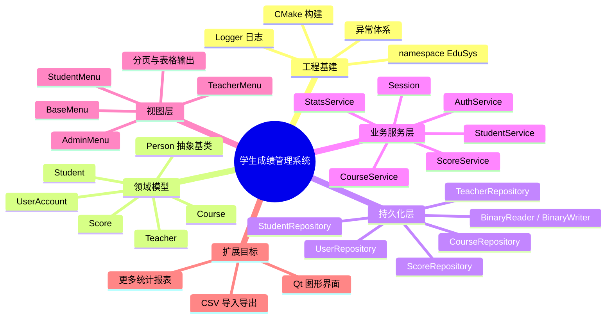
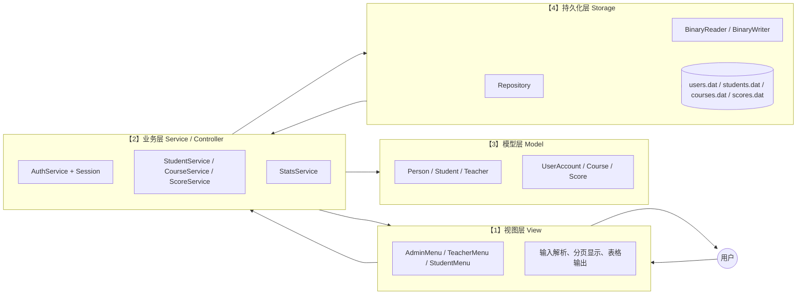
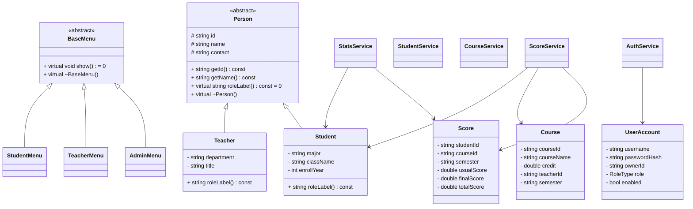
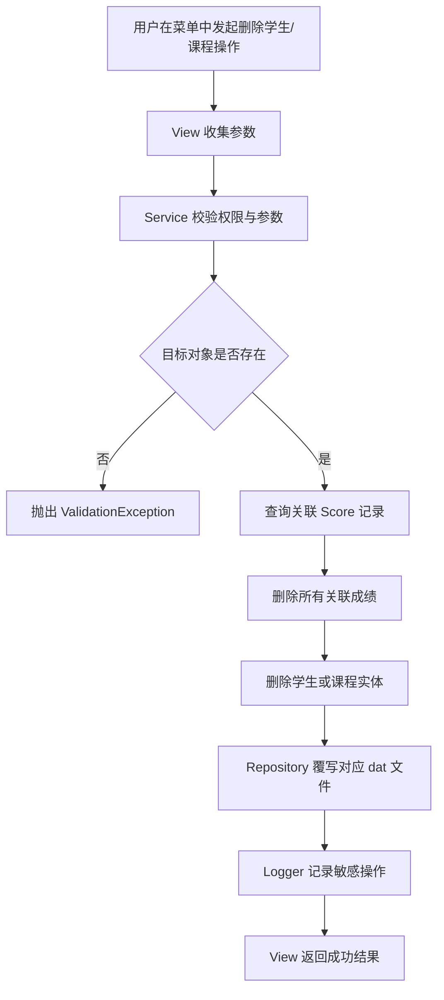
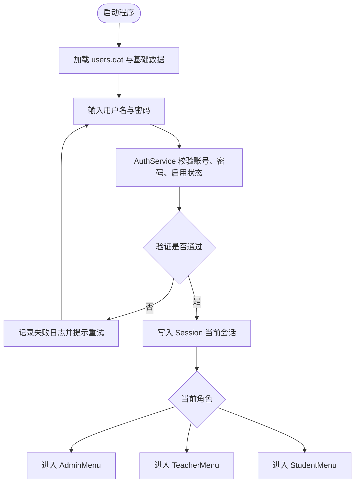

# 华南理工大学 高级语言程序设计大作业
# 开题报告（修订版）

**作业题目**：学生成绩管理系统  
* **学    院**：计算机科学与工程学院  
* **专    业**：计算机类2025级1班  
* **学生姓名**：夏同  
* **学生学号**：202530451676  
* **任课教师**：徐红云  

---

## 1. 选题的背景和意义

随着高校教学管理数字化程度的不断提高，学生成绩数据已不再只是“录入后存档”的静态信息，而是课程教学评价、学业预警、奖学金评定与学生发展分析的重要依据。传统的纸面登记或零散表格虽然能够完成最基础的分数记录，但在数据一致性、批量查询、统计分析和权限隔离方面存在明显短板。一旦涉及教师录分、学生查分、课程成绩统计、异常成绩排查等稍复杂的场景，人工维护方式很容易产生重复劳动、信息割裂和误操作风险。

基于此，本课题拟开发一套以 `C++17` 为唯一核心实现语言、面向控制台交互、具备清晰分层结构的“学生成绩管理系统”。系统遵循“先做稳、再做全”的原则，优先保证基础业务闭环完整：能够完成用户登录、学生信息管理、课程信息管理、成绩录入与查询、学业统计分析以及二进制文件持久化。相较于追求过度复杂的技术展示，本项目更强调在课程作业约束下，把一个中等规模软件系统做得结构清晰、职责分明、行为可验证、结果可演示。

从软件工程与面向对象程序设计训练的角度看，本项目具有较强的综合实践意义。系统将通过 `Person -> Student / Teacher` 的实体继承体系与 `BaseMenu -> AdminMenu / TeacherMenu / StudentMenu` 的界面继承体系，体现封装、继承、多态等 C++ 核心特性；通过模板化的仓储层与通用算法工具，体现泛型编程思想；通过异常类、RAII 资源管理、显式序列化接口等做法，训练较规范的工程实现能力。项目不会刻意堆叠不必要的技术噱头，而是把“为什么这样设计”“这样设计如何落地”讲清楚并真正实现出来。

从应用价值看，学生成绩管理系统天然适合作为课程大作业的业务载体：数据对象明确，业务关系清晰，既包含基础的增删改查，又包含排序、筛选、统计、权限控制、文件输入输出等多类编程要点。更重要的是，本项目在第一阶段即坚持将 `Model`、`Service/Controller`、`View` 与 `Storage` 分层剥离，这样既能满足当前控制台版本的开发需要，也为后续平滑接入 Qt 图形界面预留了接口边界，而无需推倒重来。

因此，本课题的目标并不是构造一个空泛的“企业级”概念样板，而是在严格遵守课程要求、仅使用 C++ 及标准库的前提下，完成一个真正可以编译、运行、保存数据、重复使用并具备一定扩展能力的完整教务类程序。这种“可交付优先”的实现思路，更符合课程项目的训练目的，也更利于最终答辩展示与后续迭代。

---

## 2. 工作任务分析

为保证项目既体现面向对象设计能力，又能在课程周期内稳定交付，本系统不再追求过深的对象图序列化和过早的复杂工程化，而是围绕“实体建模、权限控制、文件持久化、业务服务、统计分析、控制台交互”六条主线展开。整体任务划分如下。

### 2.1 工程基建与编码规范模块（项目骨架层）

* **建立统一的工程目录与构建方式**：项目从一开始就引入 `CMakeLists.txt`，而不是在开发末期再补构建脚本。这样做有两个目的：一是尽早固定头文件组织与源码边界；二是保证项目从一开始就可以在不同环境下重复构建，便于后续在 Windows 与 Linux 环境中验证可移植性。

* **制定统一的命名空间、头文件与异常规范**：全项目使用独立命名空间 `EduSys`，避免污染全局作用域；禁止在头文件中编写 `using namespace std;`；基础异常统一继承自系统自定义异常基类，如 `EduException`、`StorageException`、`AuthException`、`ValidationException` 等，使错误含义清晰可区分。

* **贯彻 RAII 与资源安全原则**：所有文件流对象、容器对象与字符串资源优先依赖标准库自动管理生命周期；如确有动态分配需求，优先使用 `std::unique_ptr` 或 `std::shared_ptr`，避免无主裸指针；多态基类显式声明虚析构函数，防止通过基类指针释放派生类对象时发生未定义行为。

* **明确“哪些地方允许复杂，哪些地方必须克制”**：本项目鼓励在模板、继承、异常、文件流等课程重点上做规范实现，但不鼓励为展示技巧而手写不必要的数据结构。例如，在没有性能或教学硬性要求时，优先使用 `std::vector`、`std::map`、`std::unordered_map` 组织数据，而不是一开始就自造双向链表或通用容器框架。

* **建立基础日志与调试策略**：考虑到本项目是单线程控制台程序，日志系统采用“同步追加写入”的轻量方案即可，不引入异步线程与复杂缓冲队列。通过 `Logger` 单例统一记录启动、登录失败、敏感操作、存储异常等关键信息，既保留项目完整性，又避免无谓的实现复杂度。

### 2.2 领域模型与数据关系模块（Model 层）

* **抽象人员实体但避免让基类承担过多职责**：系统保留 `Person` 作为抽象基类，用于抽取人员共有属性，如编号、姓名、联系方式等；由其派生出 `Student` 与 `Teacher`。但 `Person` 不再承担密码存储、菜单展示或 GPA 计算等额外职责，从而避免出现“教师也必须实现 GPA”这类边界混乱问题。

* **将“登录账户”与“业务实体”解耦**：新增 `UserAccount` 实体，用于描述登录账号、密码哈希、角色类型、关联实体编号、启用状态等信息。这样，认证逻辑围绕 `UserAccount` 展开，而学生、教师等业务对象保持纯粹的数据实体角色。对于管理员账号，可直接存在于 `UserAccount` 中而不强制对应 `Person` 派生对象。

* **采用“实体 + 关联记录”的建模方式描述成绩关系**：学生成绩不直接深嵌套在 `Student` 对象内部，也不使用跨对象原始指针互相引用；而是将 `Score` 设计为独立记录，内部仅保存 `studentId`、`courseId`、`semester`、`usualScore`、`finalScore`、`totalScore` 等字段。课程由 `Course` 实体描述，教师与课程通过 `teacherId` 关联。这样可以大幅简化数据保存、查询与删除时的一致性维护。

* **用“ID 关联”替代“对象图持有”**：在内存中，主数据对象由容器统一托管，实体关系主要通过编号关联，而不是大量互相持有对象地址。该策略的优点在于：第一，删除学生或课程时更容易做级联清理；第二，二进制持久化时不需要序列化复杂指针结构；第三，更接近实际数据库式建模思路，结构更加稳定。

* **合理使用继承与多态，不做过细拆分**：第一版系统使用 `Person -> Student / Teacher` 以及 `BaseMenu -> AdminMenu / TeacherMenu / StudentMenu` 两条继承链即可体现面向对象思想。诸如“按大一到大四再细分学生子类”“引入助教多重继承与虚继承”等做法可以保留为后续扩展点，但不作为首版核心实现，以防项目复杂度失控。

### 2.3 数据持久化与仓储模块（Storage / Repository 层）

* **采用多文件二进制存储，而非整体对象快照**：系统不使用数据库，底层存储采用标准库文件流与二进制文件。与其将整个系统对象图一次性“硬拷贝”到磁盘，不如按业务维度拆分数据文件，例如 `users.dat`、`students.dat`、`teachers.dat`、`courses.dat`、`scores.dat`。这种拆分方式更利于调试、恢复、升级和模块化维护。

* **坚持显式序列化，而非直接写对象内存**：凡是包含 `std::string`、`std::vector` 等成员的类，绝不允许通过 `reinterpret_cast` 直接整块写入文件。每个可持久化实体应提供显式的 `writeTo(BinaryWriter&) const` 与 `readFrom(BinaryReader&)` 风格接口，由统一的二进制读写辅助类负责基本类型与字符串的编码和解码。

* **构建面向实体的仓储接口**：为减少重复代码，可引入模板化仓储基础类，例如 `BinaryRepository<T>` 负责统一的加载、保存和批量覆写流程；而 `StudentRepository`、`CourseRepository`、`ScoreRepository` 等在其基础上再补充面向具体实体的查询规则。这种“模板做共性、具体类做个性”的用法，比试图用一个超级泛型 `IDao` 承担所有逻辑更稳妥。

* **在启动阶段建立内存索引**：数据从文件加载后，控制层可利用 `std::unordered_map<std::string, std::size_t>` 之类结构，为学生编号、课程编号、账号名等字段建立索引，以提升查找效率。这里的优化重点是“中小规模数据下足够快且足够清晰”，而不是追求高并发或极端性能指标。

* **区分“结构化存储”与“安全防护”**：二进制文件的主要价值在于结构化保存与降低手工误改概率，而不应夸大为真正的安全防篡改手段。真正的安全控制仍然来自权限设计、密码哈希、输入校验和业务约束。这样表述更严谨，也更符合课程项目实际。

* **设计轻量的版本与恢复策略**：可在文件头加入简单的版本号或记录数，便于后续升级格式时进行兼容判断；遇到文件不存在时，允许系统自动创建空数据文件或加载初始化样例数据，保证首次启动体验平滑。

### 2.4 业务服务与控制调度模块（Service / Controller 层）

* **以服务类承接核心业务，而不是把逻辑塞进实体类**：系统核心业务建议拆分为 `AuthService`、`StudentService`、`CourseService`、`ScoreService`、`StatsService` 等。实体类只负责表示数据，不直接承担“录入成绩”“选课”“批量统计”“打印菜单”等流程性操作，从而避免形成巨大的上帝类或“胖实体”。

* **以 `UserAccount + RoleType + Permission` 组织权限控制**：权限系统不必在每个函数里散落 `if(role == ...)` 判断，而是将角色权限集中封装在认证与授权层中。控制器在真正执行业务前，先由会话上下文与权限检查函数判断当前账号能否操作，再进入相应服务。这样既保留 RBAC 思路，又避免到处复制权限分支。

* **实现清晰的会话上下文模型**：`Session` 负责记录当前登录账号、角色、关联实体编号和当前登录状态。视图层不直接读写底层文件，只通过控制层与服务层访问会话信息，从而保证登录、登出、身份切换等行为处于统一入口。

* **把级联删除放在服务层统一处理**：删除学生时，由 `StudentService` 或更高层协调器先删除该学生的所有成绩记录，再删除学生本身；删除课程时，同样先清理关联成绩，再更新课程与教师关联信息。级联删除是本项目数据一致性的核心保障之一，应当显式设计并重点测试。

* **强化输入校验与异常边界**：学号重复、课程编号重复、成绩超范围、空名称、非法学期、教师录入未授权课程成绩等场景，都应在服务层主动校验并抛出明确异常，由上层视图统一捕获后给出友好提示。这样既体现异常处理机制，又避免错误悄悄污染持久化文件。

### 2.5 统计分析与报告导出模块（Algorithm / Report 层）

* **聚焦高价值、可展示的统计功能**：首版系统重点完成以下统计内容：某学生总评与 GPA、某课程成绩分布、班级平均分、及格率、优秀率、按总分或单科成绩排序、按条件筛选挂科学生列表。这些功能既符合成绩管理系统主题，又能充分展示算法、容器与模板的应用。

* **以函数模板封装通用算法工具**：例如可设计 `sortBy`、`filterIf`、`paginate`、`computeAverage`、`computePassRate` 等通用模板函数，使算法与具体实体结构保持适度解耦。模板的使用应服务于减少重复代码，而不是为了形式而泛型化一切。

* **统一 GPA 计算口径并集中实现**：GPA 不再放在 `Person` 这类抽象基类中，而是放在 `StatsService` 中根据学生成绩数据统一计算，必要时可为不同培养层次预留不同公式。这样可以避免“一个基类承担所有统计责任”的设计失衡，也方便后续调整计算规则。

* **导出学业预警与统计文本报告**：当学生存在挂科门数超限、平均分过低或 GPA 低于阈值等情况时，系统可通过 `std::ofstream` 自动生成文本格式的预警报告。这里的重点不是花哨排版，而是实现从数据筛选、结果格式化到物理文件落地的完整闭环。

* **将 CSV 读写定义为二期扩展，而非首版阻塞项**：CSV 与 Excel 互通很有价值，但比起登录、成绩录入和持久化闭环，它更适合作为首版完成后的增强功能。文档中保留该目标，说明扩展方向，但不让其干扰主线交付。

### 2.6 视图交互、测试与交付模块（View / QA 层）

* **视图层坚持“只负责交互，不负责计算”**：`BaseMenu` 及其派生类只承担菜单展示、输入采集、格式化输出、分页切换、错误消息展示等职责，绝不直接修改文件或书写统计计算逻辑。这样既符合 MVC 边界，也使未来接入 Qt 时能够直接复用服务层。

* **优化控制台可用性而非追求花哨界面**：在 CLI 环境下，通过清晰的主菜单分层、操作编号、返回路径提示、分页显示和表格式输出，就能显著提升系统可用性。与其设计复杂 ASCII 图形，不如优先保证信息对齐、错误提示明确、操作流程顺畅。

* **从一开始准备测试数据与验证案例**：课程项目若没有固定测试集，很容易在功能越来越多后出现回归错误。系统应预置少量管理员、教师、学生、课程和成绩样例，用于验证登录、授权、录分、查询、排序、删除、保存重启等关键流程。

* **将“可交付”作为工程目标**：最终交付不仅包括源码，还包括构建脚本、示例数据、运行说明、测试用例清单和关键类图/流程图。这样才能保证老师或同学拿到项目后可以编译、运行、复现结果，而不是只看文档中宏大的设想。

---

## 3. 计划的项目结构及其说明

以下是本项目在修订后的总体结构设计。该结构以“实体纯净、服务居中、仓储独立、界面轻量”为核心原则组织。


*(图表 1 修订版宏观架构思维导图)*

### 3.1 推荐的项目目录结构

```text
Student_Score_Management_System/
  CMakeLists.txt
  README.md
  claude.md
  data/
    users.dat
    students.dat
    teachers.dat
    courses.dat
    scores.dat
    app.log
  include/
    EduSys/
      common/
        Constants.hpp
        Exception.hpp
        Logger.hpp
        Types.hpp
      model/
        Person.hpp
        Student.hpp
        Teacher.hpp
        UserAccount.hpp
        Course.hpp
        Score.hpp
      storage/
        BinaryReader.hpp
        BinaryWriter.hpp
        BinaryRepository.hpp
        UserRepository.hpp
        StudentRepository.hpp
        TeacherRepository.hpp
        CourseRepository.hpp
        ScoreRepository.hpp
      service/
        Session.hpp
        AuthService.hpp
        StudentService.hpp
        CourseService.hpp
        ScoreService.hpp
        StatsService.hpp
      view/
        BaseMenu.hpp
        AdminMenu.hpp
        TeacherMenu.hpp
        StudentMenu.hpp
      app/
        Application.hpp
  src/
    common/
    model/
    storage/
    service/
    view/
    app/
  docs/
    use-cases.md
    test-cases.md
```

上述结构的设计重点在于把“会被频繁修改的代码”和“相对稳定的基础设施”分开管理。`model` 目录只放实体定义；`storage` 目录只负责文件读写；`service` 层负责大多数业务规则；`view` 层只关心用户看见什么和输入什么；`app` 层负责程序入口与依赖组装。这种组织方式便于分工、调试和后续补充功能。

### 3.2 分层架构设计图


*(图表 2 修订版分层架构图)*

该分层图强调两个关键原则。第一，业务层是唯一的调度中心：视图层不会直接写文件，仓储层也不会直接决定菜单行为。第二，模型层负责描述“系统里有什么数据”，而不直接负责“用户如何操作它们”。因此，系统中最容易发生变化的交互逻辑和最容易出错的业务规则，都被集中到了可测试性较好的服务层。

### 3.3 核心类关系设计图


*(图表 3 核心类关系图)*

这里最重要的调整有三点。第一，`UserAccount` 从 `Person` 中拆出，登录账号与业务实体解耦；第二，`Score` 作为独立关联实体存在，而不是塞进学生对象内部深度嵌套；第三，菜单多态保留在视图层，实体类不再负责展示自身，这让 `Model` 与 `View` 的边界更干净。

### 3.4 数据写入与级联删除流程图


*(图表 4 数据修改与级联删除流程图)*

级联删除流程是本项目数据一致性的关键。由于本系统不依赖数据库，因此不能把“关联清理”这件事交给外部引擎自动完成。必须由服务层显式管理：先清成绩，再删主实体，再持久化，最后记录日志。这样既符合课程项目对业务逻辑实现的考察，也能避免产生“幽灵成绩”。

### 3.5 登录与权限控制流程图


*(图表 5 登录与权限控制流程图)*

该流程图体现的是“先认证，再授权，再进入界面”的原则。登录成功后，会话上下文只保存当前账号必要信息，而不让视图层直接操作底层文件。对于管理员、教师、学生三类角色，系统允许其进入不同菜单，但公共的认证逻辑与会话管理只保留一份，避免重复实现。

---

## 4. 已有项目调研报告

在对同类 C++ 课程项目进行调研后，可以发现很多系统表面上“能运行”，但其内部结构经不起扩展和维护。本项目修订版的很多决策，正是针对这些常见问题作出的主动规避。

### 4.1 常见实现问题与风险

* **实体类直接混入输入输出逻辑**：不少项目在 `Student`、`Course` 等实体类中直接书写 `cin/cout`，甚至把输入校验和菜单打印都塞进成员函数中。这种做法虽然初期写得快，但一旦增加图形界面、文件导出或批量处理需求，底层类会迅速失去复用性。

* **登录账号与业务对象耦合在一起**：有些项目把密码直接放进学生或教师对象中，导致认证逻辑、数据展示逻辑和业务统计逻辑混成一团。这样不仅不利于权限设计，也会让“管理员账号不对应任何学生或教师实体”这类正常需求变得难以处理。

* **用原始指针构造复杂关系网**：初学者项目中经常会出现学生对象持有课程指针、课程对象又持有学生指针、成绩对象再交叉指向双方的情况。这样的对象图一旦涉及删除和持久化，就极易出现悬挂指针、重复释放或残留脏引用问题。

* **把二进制存储误解为“整块写对象”**：很多代码会直接把含有 `std::string` 的对象当作 POD 类型写进文件。这种做法本质上是在把内部指针和实现细节写入磁盘，不仅不可移植，也无法正确恢复原始数据。

* **为了展示“高级特性”而过度设计**：例如一开始就引入过细的学生子类划分、多重继承、手写链表、自建反射式通用 DAO、异步日志线程等。它们并非不能做，而是在课程项目早期做这些，会大幅推迟真正可运行版本的出现。

* **业务逻辑集中在 main 或单个巨类中**：如果登录、菜单、成绩统计、文件读写全部堆在一起，那么后续每加一个需求都要在同一块代码里修改，极易导致错误牵连和调试困难。

### 4.2 本项目对上述问题的应对思路

* **坚持模型纯净**：`Student`、`Teacher`、`Course`、`Score` 只表达数据本身，不直接处理菜单交互和文件输入输出。

* **坚持关系扁平化**：对象之间优先通过 `id` 关联，而不是通过所有权不清晰的原始指针互相持有。

* **坚持显式序列化**：所有文件写入都通过统一读写器逐字段完成，而不是直接导出对象内存布局。

* **坚持标准库优先**：容器、字符串、文件流、算法和智能指针优先采用标准库实现。标准库不是“偷懒”，而是课程项目中最可靠、最合理的工程基础。

* **坚持 MVP 优先级管理**：先保证登录、录分、查询、统计、保存/读取、级联删除这些主功能闭环，再考虑 CSV、Qt 界面、更多报表和复杂角色模型。

### 4.3 良好面向对象设计原则在本项目中的落地目标

* **单一职责原则（SRP）**：实体类只负责表达数据，仓储层只负责持久化，服务层只负责业务规则，视图层只负责人机交互。

* **开闭原则（OCP）**：新增统计口径时，优先扩展 `StatsService` 与模板算法工具；新增菜单时，优先继承 `BaseMenu`；尽量避免修改既有核心实体结构。

* **依赖倒置原则（DIP）**：高层模块依赖抽象服务接口或统一仓储边界，而不直接散落文件流细节。

* **里氏替换原则（LSP）**：`Student` 与 `Teacher` 能以 `Person` 指针或引用统一管理；不同菜单也能以 `BaseMenu` 统一调度。

* **接口隔离思想（ISP）**：不设计“全能大接口”；学生服务、课程服务、成绩服务和认证服务各自聚焦于清晰职责，而不是构造一个覆盖一切的大型系统管理类。

---

## 5. 方案拟定与分析

基于上述分析，本项目将按照“首版可交付、结构可扩展、实现可验证”的原则，拟定如下方案。

### 5.1 首版必须完成的核心功能

* **账号与登录**
  * 管理员、教师、学生三类账户登录。
  * 账号启用/停用。
  * 密码哈希存储与修改。
  * 登录失败日志记录。

* **基础信息管理**
  * 学生信息录入、修改、删除、查询。
  * 教师信息录入、修改、查询。
  * 课程信息录入、修改、删除、查询。

* **成绩管理**
  * 教师按授课课程录入或修改成绩。
  * 管理员查看全局成绩。
  * 学生仅查看本人成绩。
  * 删除学生或课程时自动级联删除相关成绩。

* **统计分析**
  * 按课程统计平均分、最高分、最低分。
  * 按班级或课程统计及格率、优秀率。
  * 按总评或单科分数排序。
  * 计算学生 GPA 并生成学业预警名单。

* **持久化与重启恢复**
  * 程序启动自动加载已有数据。
  * 数据变更后可保存到二进制文件。
  * 程序关闭重启后数据保持一致。

### 5.2 关键技术方案说明

* **密码处理方案**：不保存明文密码。考虑到课程项目约束与标准库限制，可使用自实现的轻量哈希方案，例如“固定盐值 + FNV-1a 风格散列”生成字符串摘要。其目标是避免明文直存并保证跨平台结果稳定，而不是宣称达到生产级密码学安全。

* **仓储层方案**：每类实体对应一个数据文件与一个仓储类，仓储类负责整批加载与整批覆写。对于中小规模课程数据，这种方案已经足够稳定，且比增量索引文件、事务日志文件等复杂方案更适合课程作业实现。

* **查询与排序方案**：以内存中的 `std::vector` 为主存储容器，以 `std::unordered_map` 构建快速索引，以 `std::sort`、`std::find_if`、`std::copy_if` 等算法完成筛选、搜索与排序。这样既能体现 STL 能力，又能保证代码简洁。

* **日志方案**：采用单例 `Logger` 统一向 `app.log` 追加文本日志，记录异常、敏感操作和认证失败事件。由于系统本身是单线程 CLI 程序，因此同步日志足以满足需要，不再引入异步复杂度。

* **Qt 预留方案**：未来若引入 Qt，新的 GUI 层应直接调用 `service` 层，不应修改 `model` 与 `storage` 的核心结构。因此在当前控制台版本中，所有可复用的数据都尽量通过普通结构体、返回值和服务接口暴露，而不是依赖控制台专属输出格式。

### 5.3 明确列为扩展项而非首版阻塞项的功能

* **CSV 导入导出**：保留为增强功能。首版重点先保证二进制读写与核心业务闭环。

* **助教角色与更复杂的多角色体系**：保留为角色扩展方向。首版先完成管理员、教师、学生三类角色。

* **更细粒度的学生分层建模**：如按大一至大四分别派生子类，属于可展示的面向对象扩展，但不是首版必须项。

* **云端部署与图形界面**：可作为演示增强或后续拓展，不影响第一阶段课程作业主功能交付。

### 5.4 为什么这一方案更适合课程项目落地

这套方案的核心优势在于“每一层都知道自己该做什么”。实体类不再承受菜单、密码、序列化、统计等过多职责；登录逻辑和业务对象剥离后，权限控制更清晰；仓储层采用显式序列化后，数据文件格式更稳定；服务层集中承接规则后，测试重点更加明确。更重要的是，这种方案不会为了展示概念而牺牲实现速度，能够较快做出一个真正可运行的版本，再在其上稳步扩展。

---

## 6. 实施计划

为了保证每一周都有明确产出，本项目实施计划按“先骨架、再存储、再业务、再视图、再测试、最后补扩展”的顺序推进。

* **第9周：搭建工程骨架与核心实体模型**
  * 建立 `CMakeLists.txt`、基础目录结构与命名空间。
  * 完成异常体系、`Logger`、通用常量与类型定义。
  * 完成 `Person`、`Student`、`Teacher`、`UserAccount`、`Course`、`Score` 的头文件与基础实现。
  * 准备少量初始化样例数据，确保程序可以编译并进入最小运行状态。

* **第10周：完成二进制读写基础设施与仓储层**
  * 实现 `BinaryReader`、`BinaryWriter`。
  * 为各实体补充显式序列化与反序列化接口。
  * 完成 `UserRepository`、`StudentRepository`、`TeacherRepository`、`CourseRepository`、`ScoreRepository`。
  * 验证“保存 -> 退出 -> 重启 -> 重新加载”的完整流程。

* **第11周：完成认证、会话与基础业务服务**
  * 实现 `AuthService` 与 `Session`。
  * 实现学生、课程、成绩的新增、删除、修改、查询接口。
  * 完成权限检查规则，保证管理员、教师、学生访问边界正确。
  * 完成级联删除核心逻辑，并用样例数据进行验证。

* **第12周：完成控制台视图与统计分析功能**
  * 抽象 `BaseMenu`，实现 `AdminMenu`、`TeacherMenu`、`StudentMenu`。
  * 完成表格输出、分页显示、基础导航与错误提示。
  * 实现 GPA、平均分、及格率、优秀率、排序、筛选等统计功能。
  * 打通“登录 -> 进入菜单 -> 执行业务 -> 输出结果”的主流程。

* **第13周：集成调试与边界测试**
  * 系统性测试权限控制、非法输入、重复编号、越界成绩、空文件、文件丢失等情况。
  * 检查保存和删除逻辑是否会残留脏数据。
  * 修复菜单流程、异常处理和数据一致性方面的问题。
  * 补充 `docs/test-cases.md`，形成较完整的验证记录。

* **第14周：完善文档、补充增强项与准备答辩**
  * 整理类图、流程图、模块说明与运行说明。
  * 视进度补充 CSV 导出、更多统计项或演示数据。
  * 准备答辩展示脚本，突出“为何这样分层”“如何保证数据一致性”“为什么没有直接写对象内存”等关键设计理由。
  * 如时间允许，再讨论 Qt 界面适配或 Linux 环境构建验证，但不影响主版本交付。

---

## 7. Claude Code 专属开发指令（AI Developer Instructions）

作为辅助开发的 AI Agent，在依据本方案生成 C++ 代码时，必须遵守以下实现准则。它们与修订版架构保持一致，目标是帮助项目稳定落地，而不是堆叠无谓复杂度。

### 7.1 绝对禁止的实现错误

1. **禁止直接把含有 `std::string`、`std::vector` 等成员的对象整块写入二进制文件**。必须逐字段序列化，不能用“整块内存转储”替代显式读写。

2. **禁止在实体类中直接编写 `std::cin`、`std::cout` 或菜单文本**。`Student`、`Teacher`、`Course`、`Score`、`UserAccount` 等实体必须保持为纯数据对象。

3. **禁止把关系字段误当作容器下标使用**。例如成绩筛选中的阈值变量、学号、课程号等是业务标识，不是 `vector` 下标，不能混淆语义。

4. **禁止无主裸指针跨层流动**。如确需多态对象，优先使用智能指针或引用；若只是表示关联关系，优先存储 `id` 而不是对象地址。

5. **禁止把权限判断散落在所有业务函数中**。角色校验应尽可能集中在认证/授权边界或服务层入口，避免每个函数都复制一遍角色分支。

### 7.2 架构红线

1. **Model 层只表达数据，不做交互与持久化**：实体类不负责打印菜单，不直接打开文件，不承担控制台输入逻辑。

2. **Storage 层只负责文件读写，不做业务决定**：仓储层可以保存、加载、覆写记录，但不直接判断“老师能不能改这个成绩”“学生能不能看这门课”。

3. **Service 层负责规则与一致性**：级联删除、权限检查、编号唯一性、成绩范围校验、统计口径统一放在服务层处理。

4. **View 层只负责人与程序的交互**：菜单、分页、格式化输出属于视图层；视图层不得直接修改底层数据文件。

5. **所有多态基类必须有虚析构函数**：如 `Person`、`BaseMenu` 等基类都必须显式声明虚析构，保证通过基类指针销毁对象时行为正确。

### 7.3 推荐的实现倾向

1. **优先使用标准库容器与算法**：`std::vector`、`std::unordered_map`、`std::sort`、`std::find_if`、`std::copy_if` 等应成为首选工具。

2. **模板用于提炼共性，而不是泛型化一切**：可为分页、排序、仓储通用逻辑设计模板，但不要把整个系统硬做成难以理解的超级模板框架。

3. **先保证可运行，再追求更多技巧**：如果某项设计会明显拖慢主功能交付，应先选择更稳定、可验证的实现方式。

4. **保留 Qt 兼容边界，但不提前绑定 Qt 细节**：当前阶段的接口设计只需保证未来 GUI 可以复用 `service` 层，不必在控制台版本中提前引入 Qt 风格类型和信号槽逻辑。

5. **任何重要代码生成后都要围绕“能否编译、能否运行、能否保存数据、能否正确恢复”这四个问题自检**。

---

本修订版方案的核心思想可以概括为一句话：**把课程项目做成一个真正可交付的小型软件系统，而不是一个概念堆砌的大型设想图。** 在这一前提下，项目依然完整覆盖了面向对象、模板、异常、文件流、权限控制、数据结构与算法等 C++ 课程重点，同时显著降低了实施风险，更适合作为后续编码与答辩的统一依据。
