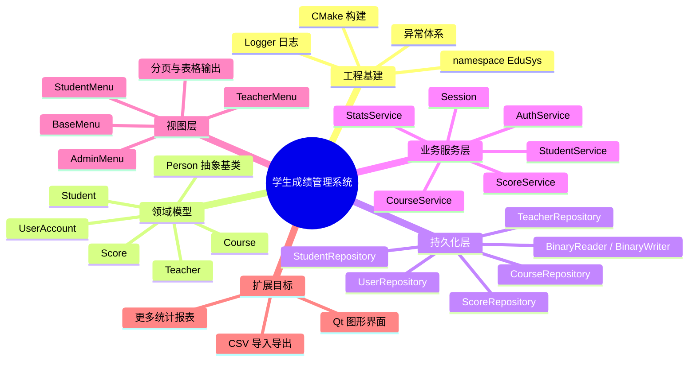
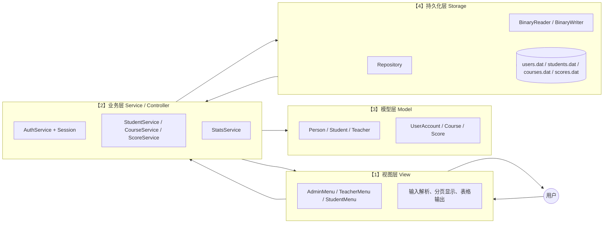
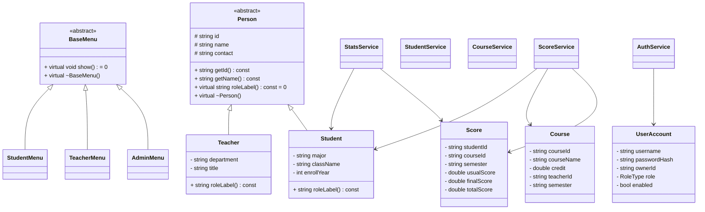
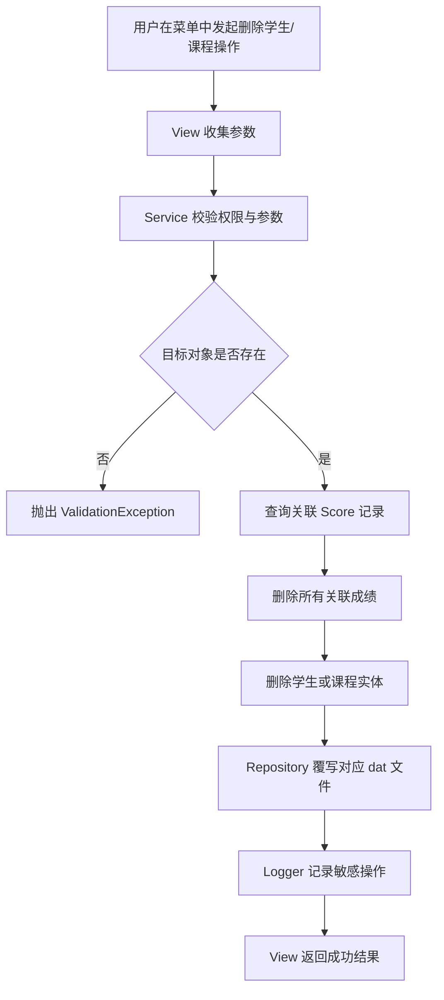
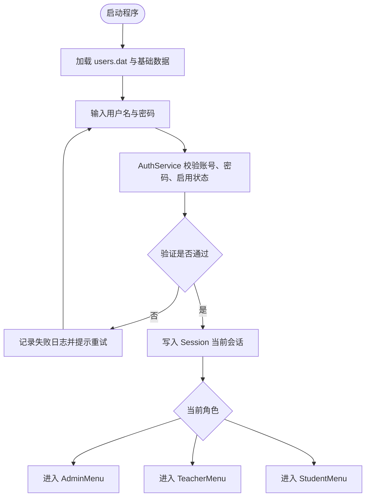

# EduSys 架构图册（答辩用）

> Week 14 文档收尾产物。本文件**直接复用** [`claude.md`](../claude.md) 中已有的 5 张 Mermaid 图，命名 / 标号都不变，只在每张图旁补一段「为什么这样画 + 当前仓库哪个文件落地」对证，让答辩老师不用翻开题报告就能看完整张架构画像。文末追加 Qt 适配讨论段，对证 [`claude.md` §5.2](../claude.md) 关于 Qt 预留方案的承诺。

## 目录

1. [图 1：宏观架构思维导图（mindmap）](#图-1宏观架构思维导图)
2. [图 2：分层架构图（flowchart LR）](#图-2分层架构图)
3. [图 3：核心类关系图（classDiagram）](#图-3核心类关系图)
4. [图 4：级联删除流程图（flowchart TD）](#图-4级联删除流程图)
5. [图 5：登录与权限控制流程图（flowchart TD）](#图-5登录与权限控制流程图)
6. [Qt 适配讨论（§5.2 兑现段）](#qt-适配讨论)

---

## 图 1：宏观架构思维导图

**仓库对证（截至 Week 14）**

| 思维导图节点 | 当前实现位置 |
| --- | --- |
| 工程基建 | [`include/EduSys/common/`](../include/EduSys/common) + [`CMakeLists.txt`](../CMakeLists.txt) + [`build.bat`](../build.bat) |
| 领域模型 | [`include/EduSys/model/`](../include/EduSys/model) 6 个头文件 |
| 持久化层 | [`include/EduSys/storage/BinaryRepository.hpp`](../include/EduSys/storage/BinaryRepository.hpp) + 5 个具体仓储 |
| 业务服务层 | [`include/EduSys/service/`](../include/EduSys/service) 6 个头文件 |
| 视图层 | [`include/EduSys/view/BaseMenu.hpp`](../include/EduSys/view/BaseMenu.hpp) + 3 个角色菜单 |
| 扩展：CSV 导出 | Week 14 已落地 → [`ReportExporter::exportRankingCsv` / `exportCourseStatsCsv`](../include/EduSys/report/ReportExporter.hpp)（仅导出，不导入） |
| 扩展：Qt 图形界面 | 未实现，本文档末尾给出适配讨论 |
| 扩展：更多统计报表 | 第 12 周 GPA / 课程统计 / 排名 / 预警 4 个入口已闭环；更多报表暂列扩展 |

> 思维导图本身不画依赖关系，只回答"系统由哪几块组成"。这是答辩第一句话能用的全景图。

---

## 图 2：分层架构图

**关键不变量（每条都对证当前代码）**

- **View → Service → Storage 单向依赖**：[`src/view/AdminMenu.cpp`](../src/view/AdminMenu.cpp) 不 `#include` 任何 `storage/`；菜单只持有 Service 引用，构造时由 [`src/app/main.cpp`](../src/app/main.cpp#L390-L402) 统一注入。
- **Storage 不做业务**：[`include/EduSys/storage/BinaryRepository.hpp`](../include/EduSys/storage/BinaryRepository.hpp) 整文件不出现 `Permission` / `Auth` / `RoleType` 等业务概念，只管 magic / version / count + `T::writeTo` / `T::readFrom`。
- **View 不直接写文件**：唯一例外是 Week 12 新增的 [`include/EduSys/report/ReportExporter.hpp`](../include/EduSys/report/ReportExporter.hpp)，它放在独立的 `report/` 子目录，明确**既不是 Service 也不是 View**，是把 StatsService 结构化结果落盘成文本的轻量适配器。Week 14 的 CSV 导出在同一个类里加方法，不破坏分层。
- **Model 是纯数据**：[`include/EduSys/model/Score.hpp`](../include/EduSys/model/Score.hpp) 等文件只有字段 + getter/setter + `writeTo / readFrom`，没有 `cin / cout / fstream`。

> 这张图的 **LR 箭头方向**是答辩重点 —— 用来回答"为什么不让菜单直接写 .dat"。答案：当 Qt 替换控制台 View 时，Service / Storage / Model 一行不动。

---

## 图 3：核心类关系图

**三个最容易被追问的设计决定**

1. **`UserAccount` 不继承 `Person`**：登录账号与业务实体解耦。
   - 落地：[`include/EduSys/model/UserAccount.hpp`](../include/EduSys/model/UserAccount.hpp) 是独立类。
   - 好处：管理员 `admin` 账号可以**不对应任何 Person 派生对象**（[`src/app/main.cpp` seed 段](../src/app/main.cpp#L86-L123) 中 admin 的 `ownerId` 为空字符串）。

2. **`Score` 不嵌进 `Student`，而是独立关联实体**：用 `(studentId, courseId, semester)` 三元组当主键。
   - 落地：[`include/EduSys/model/Score.hpp`](../include/EduSys/model/Score.hpp)。
   - 好处：删除学生 / 课程时，[`src/service/StudentService.cpp`](../src/service/StudentService.cpp#L91-L130) 与 [`src/service/CourseService.cpp`](../src/service/CourseService.cpp#L98-L125) 用一行 `std::remove_if` 就能清完关联成绩，不用追指针。

3. **多态基类全部带虚析构**：`Person` 与 `BaseMenu` 都显式声明 `virtual ~Foo()`。
   - 落地：[`include/EduSys/model/Person.hpp`](../include/EduSys/model/Person.hpp)、[`include/EduSys/view/BaseMenu.hpp`](../include/EduSys/view/BaseMenu.hpp)。
   - 好处：通过基类指针销毁派生对象时不出 UB。

---

## 图 4：级联删除流程图

**节点对证**

| 流程节点 | 对应代码 |
| --- | --- |
| B「View 收集参数」 | [`src/view/AdminMenu.cpp` studentMenu 5 号项](../src/view/AdminMenu.cpp)（输入 id + 二次确认 `yes`） |
| C「Service 校验权限与参数」 | [`StudentService::remove` requireAdmin](../src/service/StudentService.cpp#L91-L100) |
| D「目标对象是否存在」 | 同上：`std::find_if` 找不到即 `throw ValidationException` |
| F-G「查询关联 Score → 删除所有关联成绩」 | [`StudentService::remove` 步骤 1](../src/service/StudentService.cpp#L101-L108)：`scores.erase(remove_if(...))` 后 `scoreRepo_.saveAll(scores)` |
| H「删除学生或课程实体」 | [`StudentService::remove` 步骤 3](../src/service/StudentService.cpp#L120-L123) |
| I「Repository 覆写对应 dat 文件」 | [`BinaryRepository::saveAll`](../include/EduSys/storage/BinaryRepository.hpp#L54-L60) 整批覆写 |
| J「Logger 记录敏感操作」 | [`StudentService::remove` 末尾](../src/service/StudentService.cpp#L125-L129) 写 `Student removed (cascade): ...` |

> Week 11 选了 **Option A：物理删除**（不做软删），Week 13 D 组三条断言（[`docs/test-cases.md`](test-cases.md) D1-D3）正是验证这条流程跑完后没有"幽灵成绩 / 幽灵账号"残留。

> 学生删除还**多一步**：步骤 2 同步清 `users.dat` 中 `role==Student && ownerId==id` 的登录账号 —— 这是第 11 周用户拍板的级联范围（"删学生连账号一起删"），课程删除没有这一步，因为课程没有自己的登录账号。

---

## 图 5：登录与权限控制流程图

**节点对证**

| 流程节点 | 对应代码 |
| --- | --- |
| Start / Load | [`main.cpp` 启动序](../src/app/main.cpp#L488-L526)：`ensureDirectoryExists` + 5 个 Repository 构造 + `seedSampleData` 兜底 |
| Input | [`runInteractiveLoop`](../src/app/main.cpp#L390-L482) 内的 `Username / Password` 提示，空 username 直接退出 |
| Auth | [`AuthService::authenticate`](../src/service/AuthService.cpp#L23-L43)：未知用户 / disabled / 密码不对统一抛 `AuthException` 并写 WARN |
| Fail | `consecutiveFailures += 1`，达到 `kMaxFailures=3` 退出 0（不算 fatal） |
| Session | [`Session::login`](../include/EduSys/service/Session.hpp#L25-L30)：纯值对象，仅记录 username / role / ownerId |
| Role 分派 | [`runInteractiveLoop` switch](../src/app/main.cpp#L450-L467) 按 `RoleType` 分到 Admin/Teacher/Student 三个菜单 |

> Week 13 A 组 5 条断言（[`docs/test-cases.md`](test-cases.md) A1-A5）正是把这张图的所有失败分支都打了一遍 —— 未知用户 / 错密码 / 未登录 changePassword / 未登录读 / 空新密码。

---

## Qt 适配讨论

> 兑现 [`claude.md` §5.2](../claude.md) 中"未来若引入 Qt，新的 GUI 层应直接调用 service 层"的承诺。**本节是文档讨论，没有 Qt 代码**。

### 该改的部分（GUI 替换边界）

| 当前控制台层 | 替换为 Qt 时怎么做 |
| --- | --- |
| [`include/EduSys/view/BaseMenu.hpp`](../include/EduSys/view/BaseMenu.hpp) 抽象基类 + `cin/cout` 工具 | 整体丢弃。Qt 用 QMainWindow / QDialog 取代，`cin/cout` 工具不再需要 |
| [`AdminMenu` / `TeacherMenu` / `StudentMenu`](../include/EduSys/view) 三个角色菜单 | 替换为三个 QWidget 子类（如 `AdminWindow / TeacherWindow / StudentWindow`），从 Service 拿 `std::vector<Student>` 等结构填进 `QTableView` |
| [`runInteractiveLoop`](../src/app/main.cpp#L390-L482) 主循环 | 替换为 Qt 事件循环（`QApplication::exec()`），登录改为 QDialog modal |
| 登录失败 3 次退出策略 | 在登录 QDialog 里数失败次数即可；Service 层不需要知道这个策略 |

### 不该改的部分（Service / Storage / Model 完全复用）

- **所有 Service 类**：[`AuthService`](../src/service/AuthService.cpp)、[`StudentService`](../src/service/StudentService.cpp)、[`CourseService`](../src/service/CourseService.cpp)、[`ScoreService`](../src/service/ScoreService.cpp)、[`StatsService`](../src/service/StatsService.cpp) 全部一行不动。它们的方法签名（`std::vector<...>` / 结构体 / 异常）已经是 GUI 中立的。
- **所有 Repository 类**：[`BinaryRepository<T>`](../include/EduSys/storage/BinaryRepository.hpp) 与 5 个具体仓储一行不动。Qt 只读 Service，不直接读 Repository。
- **所有 Model 类**：[`include/EduSys/model/`](../include/EduSys/model) 6 个实体一行不动。Score / Student 等结构直接喂给 `QTableView` 的 model adapter 即可。
- **`Session` 值对象**：[`Session.hpp`](../include/EduSys/service/Session.hpp) 一行不动。Qt 主窗口持有一个 `Session` 实例，登录窗口填它，登出时清空。
- **`ReportExporter`**：Week 12/14 的 `.txt` 与 `.csv` 导出逻辑一行不动。Qt 触发方式从"菜单第 5 项"换成"按钮 click 信号"。

### 验证方式（如真要做 Qt）

把 [`AdminMenu::run`](../src/view/AdminMenu.cpp#L37-L63) 里的 `switch(choice)` 拆成几个 Qt slot，每个 slot 调对应 Service 方法 → 拿返回值 → 塞进 widget。如果发现哪个 Service 接口需要调整才能给 Qt 用，那就是当前的 GUI 中立性还不够；目前看下来不需要。

### 不引入 Qt 的取舍

课程项目交付以"控制台版本 + 全套自检 + 全套文档"为主线，Qt 适配作为讨论项保留是 [`claude.md` §5.3](../claude.md) 明确列入"扩展项而非首版阻塞项"的决策。本图册的存在本身就是为了让"如果未来真要做"时不至于推倒重来。

---

## 与其它文档的关系

- 本文 5 张图直接出自 [`claude.md`](../claude.md) §3.1-§3.5，命名 / 标号未变；本文新增的只是"对证当前代码"的左右栏与 Qt 段。
- 测试用例汇总在 [`docs/test-cases.md`](test-cases.md) —— A-F 六组共 25 条 + sanity，对证本图册图 4 / 图 5 的所有失败分支。
- 答辩问答稿在 [`docs/defense.md`](defense.md) —— 把图册中"为什么这样画"的内容加工成 Q&A 速查。
- 详细周报与运行证据在 [`README.md`](../README.md) —— 顶部 TL;DR 给最快路径，下面按周展开。
